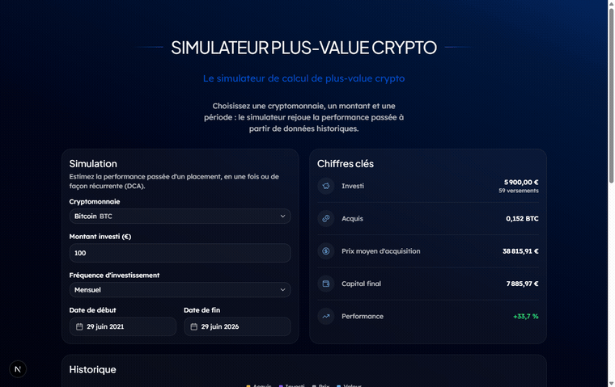
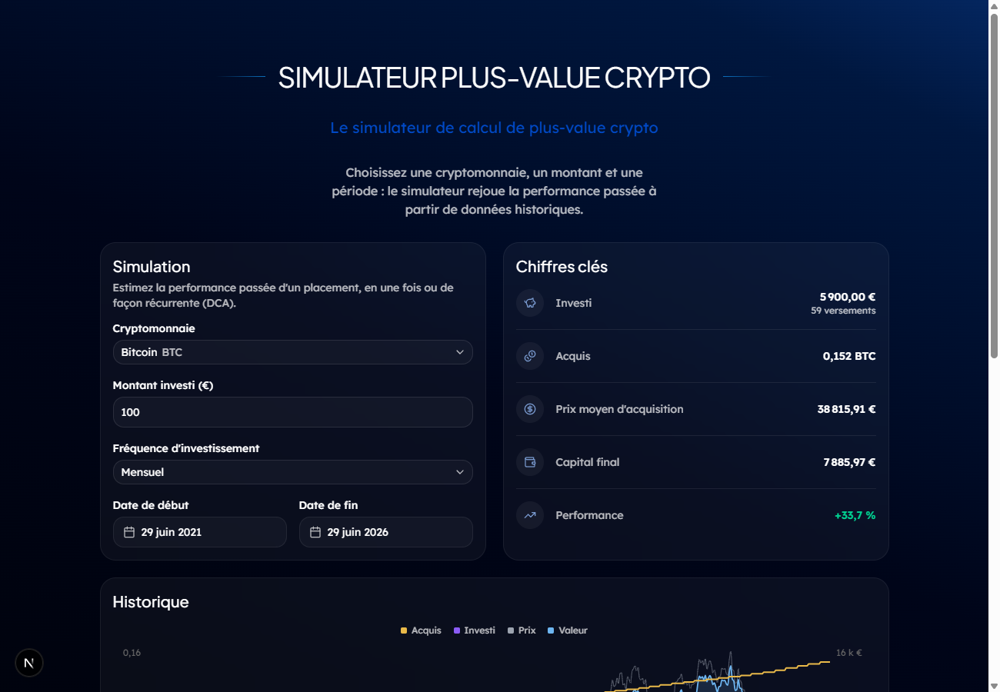
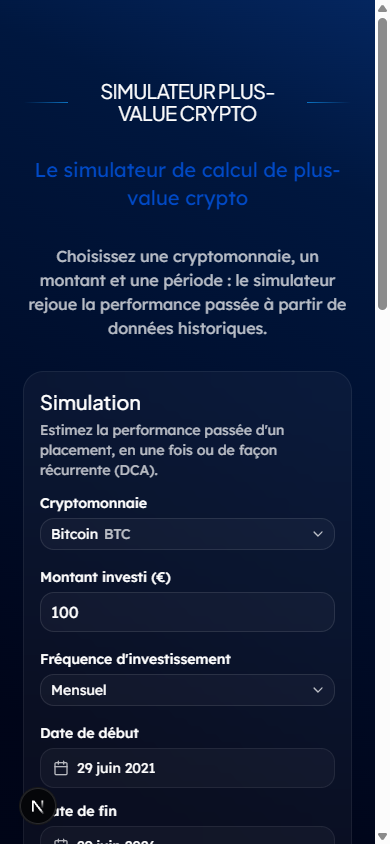
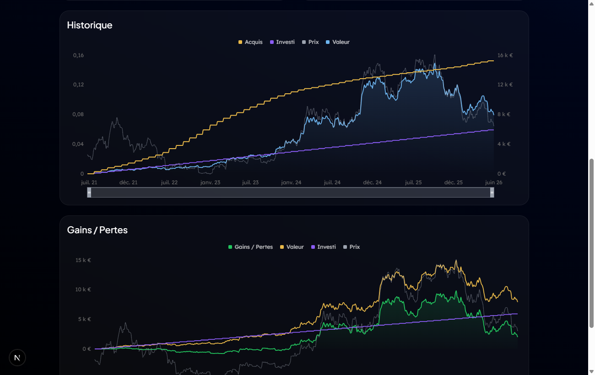

# Crypto Simulator

Simulateur de plus-value crypto inspiré de la direction artistique « fintech premium » de
[simulateurs.sinvestir.fr](https://simulateurs.sinvestir.fr/) (voir [design.md](design.md)).

## Aperçu



| Bureau | Mobile |
|---|---|
|  |  |



## Le simulateur

On rejoue un investissement **passé** à partir d'un historique de prix quotidiens
(« backtesting »), en une fois ou de façon récurrente (**DCA**), avec **calcul en temps réel** :

- **Entrées** : cryptomonnaie, montant, fréquence (unique / quotidien / hebdo / mensuel), période.
- **Résultats** (mis à jour à la volée) : total investi, quantité acquise, prix moyen
  d'acquisition, capital final, performance (%).
- **Graphiques** : « Historique » (Acquis / Investi / Prix / Valeur) et « Gains / Pertes »,
  avec zoom temporel.

Le composant est **autonome** : aucune base de données, aucune authentification et
**aucune clé API** ne sont nécessaires pour le faire tourner.

- Moteur de calcul (fonction pure, testable) : [lib/backtest.ts](lib/backtest.ts)
- Prix historiques : [app/api/prices/route.ts](app/api/prices/route.ts) (proxy Binance, sans clé)
- UI colocalisée : [app/_components/](app/_components/), [app/_hooks/](app/_hooks/),
  [app/_types/](app/_types/), [app/dto/](app/dto/)

## Stack technique

| Couche | Choix |
|---|---|
| Framework | **Next.js 16** (App Router, Turbopack) + React 19 |
| UI | **shadcn/ui** (Radix) + **Tailwind CSS v4** |
| Formulaires | **React Hook Form** + **Zod v4** (`@hookform/resolvers`) |
| Graphiques | **Recharts** |
| Données | API publique **Binance** (prix EUR, sans clé) |
| Déploiement | **Vercel** |

## Prérequis

- [Node.js](https://nodejs.org/) **24+** (voir le champ `engines` de `package.json`).

## Démarrage

Aucune configuration ni variable d'environnement n'est requise :

```bash
npm install
npm run dev
```

L'app tourne sur http://localhost:3000.

> Le dépôt inclut un `.npmrc` (`include=dev`) qui force l'installation des `devDependencies`
> même si `NODE_ENV=production` est présent dans l'environnement — sans quoi Tailwind/PostCSS/
> TypeScript seraient ignorés (erreur 500 « Cannot find module '@tailwindcss/postcss' »).

### Configuration optionnelle

Le rate limiting de la route `/api/prices` s'ajuste sans redéploiement de code via deux
variables d'environnement (valeurs par défaut : **30 requêtes / 60 s** par IP) :

| Variable | Rôle | Défaut |
|---|---|---|
| `PRICES_RATE_LIMIT` | Requêtes autorisées par IP et par fenêtre | `30` |
| `PRICES_RATE_WINDOW` | Durée de la fenêtre, en **secondes** | `60` |

Voir [.env.example](.env.example).

## Tests

Deux niveaux de tests, séparés par runner :

| Commande | Type | Portée |
|---|---|---|
| `npm test` | **Unitaires** ([Vitest](https://vitest.dev/)) | logique métier pure et hooks |
| `npm run test:watch` | Unitaires (watch) | idem, en mode interactif |
| `npm run test:e2e` | **End-to-end** ([Playwright](https://playwright.dev/)) | parcours navigateur réel |

**Unitaires** (`*.test.ts`) — moteur de backtest ([lib/backtest.test.ts](lib/backtest.test.ts)),
validation Zod ([app/dto/simulator.schema.test.ts](app/dto/simulator.schema.test.ts)), rate
limiting ([lib/rate-limit.test.ts](lib/rate-limit.test.ts)), formatage et hook temps réel
([app/_hooks/useLiveSimulation.test.ts](app/_hooks/useLiveSimulation.test.ts)). Environnement
`node`, sauf les hooks (jsdom via docblock). NODE_ENV est forcé à `test` dans
[vitest.config.ts](vitest.config.ts) (l'environnement définit `NODE_ENV=production`, ce qui
chargerait le build de production de React, dépourvu de l'API `act`).

**End-to-end** (dossier [e2e/](e2e/)) — saisie d'un montant et défilement de la page d'accueil,
et page `/embed`. Playwright démarre le serveur de dev automatiquement. La route `/api/prices`
est **interceptée** ([e2e/utils.ts](e2e/utils.ts)) pour un rendu déterministe, sans dépendre de
la disponibilité de Binance. Prérequis la première fois : `npx playwright install chromium`.

## Design system

La direction artistique de [simulateurs.sinvestir.fr](https://simulateurs.sinvestir.fr/) est
documentée dans [design.md](design.md) et intégrée dans [app/globals.css](app/globals.css) :
les tokens de marque (bleu `#0049C6`, fond nuit `#080C16`, dégradé diagonal, rayons) sont mappés
sur les variables sémantiques de shadcn/ui, donc **tous les composants en héritent automatiquement**.
Polices : **Plus Jakarta Sans** (titres) + **Lexend** (corps). Mode **sombre** par défaut,
avec animations d'entrée (fade-in + slide-up).

## Embedding (aperçu intégré)

Le simulateur est conçu pour être embarqué depuis un autre site (ex. `sinvestir.fr`) :

- Route dédiée **`/embed`** ([app/embed/page.tsx](app/embed/page.tsx)) : uniquement l'outil,
  sans hero ni navigation, `noindex`.
- **Auto-hauteur** : la page publie sa hauteur réelle au site hôte via `postMessage`
  ([app/embed/_components/EmbedAutoHeight.tsx](app/embed/_components/EmbedAutoHeight.tsx)),
  pour redimensionner l'`<iframe>` sans scroll interne.
- Exemple d'intégration complet (avec écoute du message) :
  [public/embed-example.html](public/embed-example.html) → accessible sur `/embed-example.html`.

```html
<iframe src="https://<votre-deploiement>/embed" title="Simulateur crypto" style="width:100%;border:0"></iframe>
<script>
  window.addEventListener("message", (e) => {
    if (e.data?.type === "sinvestir-simulator:height") {
      document.querySelector("iframe").style.height = e.data.height + "px";
    }
  });
</script>
```

> Par défaut le framing est autorisé partout (pratique pour tester). En production, on
> restreindrait les hôtes via l'en-tête `Content-Security-Policy: frame-ancestors https://sinvestir.fr`.

## Partis pris techniques

- **Next.js + Vercel** : aligné sur la stack interne S'investir → intégration directe dans
  l'infra, et le simulateur peut prendre la place de l'actuel sur `simulateurs.sinvestir.fr`.
- **Source de prix = Binance (sans clé)** : CoinGecko et CryptoCompare exigent désormais une
  clé API (réponses `401` en accès anonyme), et le tier démo de CoinGecko plafonne l'historique
  à 365 jours. Binance expose des paires EUR et un historique long **sans authentification**,
  ce qui garde la démo **« clone & run »**. La récupération passe par une **route API interne**
  ([app/api/prices/route.ts](app/api/prices/route.ts)) qui isole le fournisseur (changer de
  source ne touche pas le front), évite les soucis CORS et **met en cache 1 h**.
  Le proxy étant public, il est protégé par un **rate limiting par IP**
  ([lib/rate-limit.ts](lib/rate-limit.ts), en mémoire, fenêtre fixe) : au-delà de la
  limite, la route répond `429` avec un en-tête `Retry-After`. La limite est
  **configurable par variables d'environnement** (voir ci-dessous). _Note : l'état
  étant en mémoire du process, la limite s'applique par instance ; en déploiement
  multi-instances, remonter vers un store partagé (Redis / Upstash)._
- **Moteur de calcul = fonction pure** ([lib/backtest.ts](lib/backtest.ts)) : sans dépendance
  réseau/UI, donc **testable** et réutilisable côté serveur. Recherche de prix par dichotomie,
  timeline échantillonnée pour les graphiques.
- **Calcul en temps réel** ([app/_hooks/useLiveSimulation.ts](app/_hooks/useLiveSimulation.ts)) :
  les prix ne sont rechargés que si la crypto ou la période change (avec cache) ; toute autre
  modification recalcule le backtest **localement, sans appel réseau**. Le montant saisi est
  **débouncé à 500 ms** ([app/_hooks/useDebouncedValue.ts](app/_hooks/useDebouncedValue.ts)).
- **Logique dans des hooks, composants présentationnels** : le formulaire et les résultats se
  contentent d'afficher l'état exposé par les hooks.
- **Validation Zod en DTO** : un schéma unique sert de source de vérité, les types sont dérivés
  (`z.infer`) plutôt que dupliqués.
- **Design system mappé sur shadcn** : les tokens de `design.md` alimentent les variables
  sémantiques shadcn → fidélité visuelle sans surcharger chaque composant.
- **Peu de dépendances, composant embarquable** : le simulateur est un bloc autonome
  (`<Simulator />`), pensé pour l'embedding (aucune dépendance à une BDD ou à l'auth).

## Structure

- [design.md](design.md) — direction artistique de référence (palette, surfaces, dégradés)
- [app/globals.css](app/globals.css) — tokens du design system (Tailwind v4 `@theme` + thème shadcn)
- [lib/](lib/) — moteur de backtesting et formatage
- [app/](app/) — page, route API et UI colocalisée du simulateur

## Au-delà du simulateur

Le dépôt contient aussi une amorce d'infrastructure (`docker-compose.yml` Supabase/PostgreSQL,
`.env.example`) et une configuration de serveurs MCP ([.mcp.json](.mcp.json)) issues de la vision
produit plus large décrite dans [CLAUDE.md](CLAUDE.md). **Rien de tout cela n'est nécessaire pour
lancer ou déployer le simulateur.**
